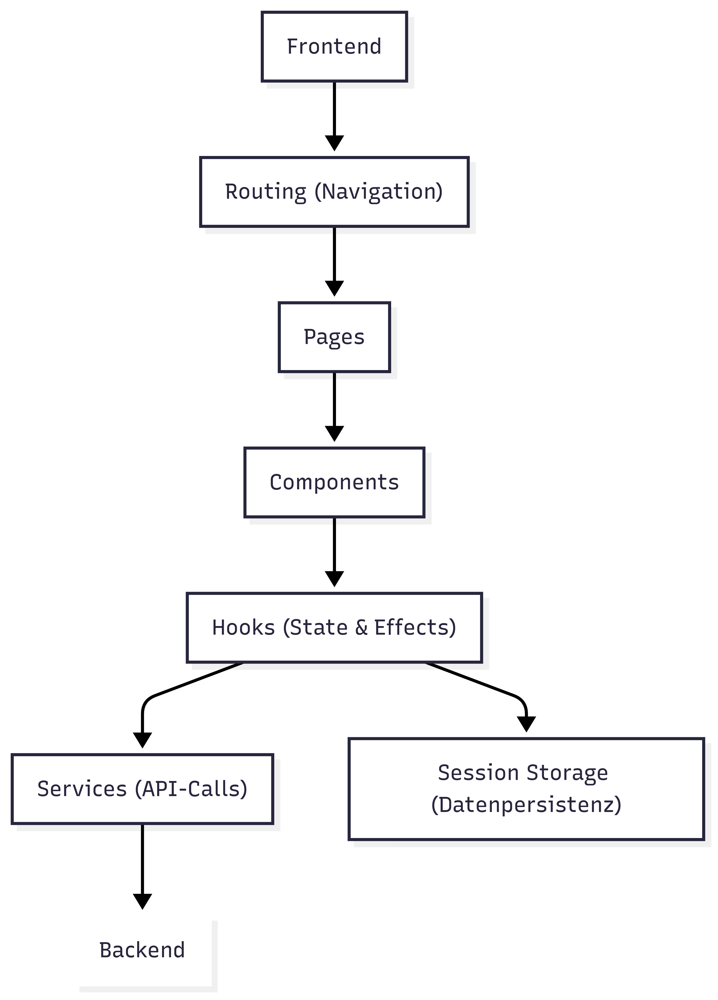
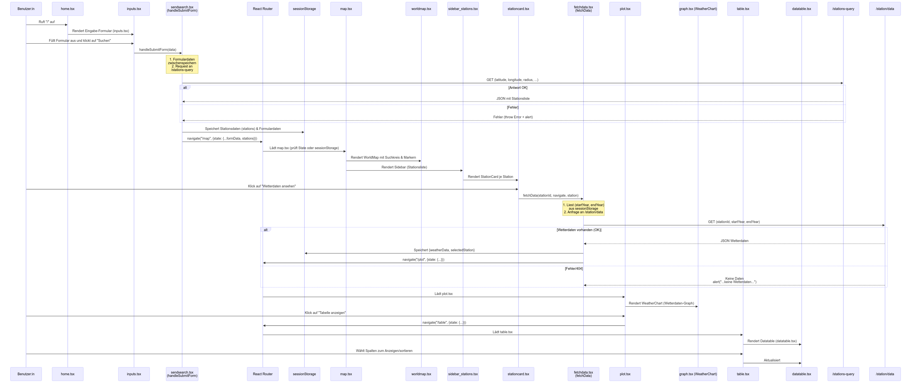

# Überblick des Frontend von ClimateLens
"ClimateLens" ist eine Single-Page-Anwendung (SPA) zur interaktiven Visualisierung von Wetterdaten, die auf Basis benutzerdefinierter Suchkriterien wie geographischen Koordinaten, Suchradius und Zeitintervallen arbeitet. Die Anwendung wurde mit React und TypeScript entwickelt. Das **Frontend von Climate Lens** ist wie folgt aufgebaut:
 
 

 

**React Router:** 
Der *App-Router*, basierend auf React Router, ermöglicht die Navigation zwischen den einzelnen *Pages* (Home, Map, Plot, Table).

**Komponentenstruktur und Hooks:**
Die einzelnen Seiten bestehen aus *Komponenten*, die jeweils eigene Zustandslogiken implementiert haben. *Hooks* wie useEffect werden genutzt, um beim Laden der Komponente Initialisierungen (z. B. Datenabrufe oder das Setzen von Session Storage-Werten) durchzuführen.

**State Management und Session Storage:**
Neben der lokalen Zustandsverwaltung innerhalb der Komponenten (z. B. über useState) wird die Session Storage verwendet. Dies dient der Speicherung von benutzerbezogene Daten und den Ergebnissen der API-Calls. Dies ermöglicht es, den Zustand zwischen den verschiedenen Seiten beizubehalten, ohne dass Daten bei der Navigation verloren gehen.

**Service-Aufrufe und API-Calls:**
In Service-Funktionen (siehe [Sendsearch.tsx](../src/services/Sendsearch.tsx) und [Fetchdata.tsx](../src/services/Fetchdata.tsx)) werden API-Calls an das Backend ausgeführt, um die Wetterstationen und -daten zu erhalten. Die Ergebnisse dieser API-Calls werden anschließend verarbeitet und in den Session Storage abgelegt, sodass sie in den entsprechenden Komponenten weiterverwendet werden können.

## Technischer Aufbau
Die Anwendung ist als **Single-Page-Application (SPA)** aufgebaut und umfasst vier zentrale Seiten:

- [Home](../doc/02_Home.md): Startseite mit Eingabeformular für Suchparameter.
- [Map](../doc/03_Map.md): Anzeige einer interaktiven Karte mit Suchradius und Liste der gefundenen Wetterstationen.
- [Plot](../doc/04_Plot.md): Grafische Darstellung der Wetterdaten mittels interaktivem Diagramm.
- [Table](../doc/05_Table.md): Darstellung der Wetterdaten in einer dynamisch sortierbaren und anpassbaren Tabelle.

(Über die jeweiligen Namen kann die Dokumentation eingesehen werden)

In diesen Seiten werden unterstützende Komponenten, die die Funktionalität gewährleisten, verwendet (z. B. Formulareingaben, Kartenanzeige, Station-Karten, Datenabruf).

Für die Containerisierung wird Docker verwendet.

## Systemablauf und Datenfluss
Folgendes Diagramm zeigt den gesamten Systemablauf und Datenfluss in der Anwendung aus Frontendperspektive. 

## Verwendete Bibliotheken
- **react-hook-form:** Sorgt für die Validierung und effiziente Handhabung der Formulareingaben.
- **MapLibre GL:** Wird für die Anzeige der interaktiven Weltkarte eingesetzt.
- **Turf.js:** Generiert den GeoJSON-Kreis für den Suchradius.
- **Plotly:** Dient der Erstellung interaktiver Diagramme in der Plot-Seite.

