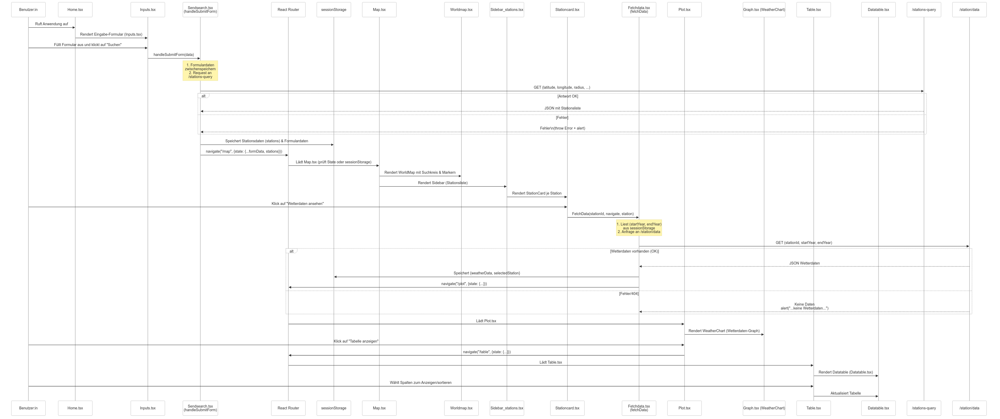

# Überblick des Frontend von ClimateLens


Das **Frontend von Climate Lens** ist wie folgt aufgebaut:

Die Nutzerinteraktion wird maßgeblich vom **App-Router** gesteuert, der das Navigieren zwischen den einzelnen Pages ermöglicht. Auf diesen Pages befinden sich **Komponenten**, in denen **Hooks** wie useEffect zum Einsatz kommen, um Aktionen beim Laden der jeweiligen Komponente auszuführen. Diese Hooks greifen wiederum auf **Services** zu, genauer gesagt auf **API-Calls**, welche das Backend ansprechen. Die Ergebnisse dieser API-Calls werden anschließend im **Session Storage** abgelegt. Ebenso werden die vom Nutzer im Frontend eingegebenen Parameter mithilfe von Hooks im Session Storage gespeichert.


## Systemablauf und Datenfluss



## Pages Dokumentation
- [Home](../doc/02_Home.md): Dokumentaion für Startseite mit Eingabemaske<br>
- [ Map](../doc/03_Map.md): Dokumentation für Kartenansicht <br>
- [Plot](../doc/04_Plot.md): Dokumentation für Plotansicht<br>
- [Table](../doc/05_Table.md): Dokumentation für Tableansicht <br>


## Ordner Struktur

```
├── src
│   ├── components 
│   │   ├── datatable.tsx
│   │   ├── graph.tsx
│   │   ├── inputs.tsx
│   │   ├── sidebar_stations.tsx
│   │   ├── stationcard.tsx
│   │   └── worldmap.tsx
│   ├── layouts
│   │   └── header.tsx
│   ├── pages
│   │   ├── home.tsx
│   │   ├── map.tsx
│   │   ├── plot.tsx
│   │   └── table.tsx
│   ├── services
│   │   ├── fetchdata.tsx
│   │   └── sendsearch.tsx
│   ├── App.css
│   ├── App.tsx
│   ├── index.css
│   └── main.jsx
├── .dockerignore 
├── .gitignore
├── Dockerfile
├── eslint.config.js 
├── index.html 
├── LICENSE 
├── package-lock.json
├── package.json
├── README.md
└── tsconfig.json
```


