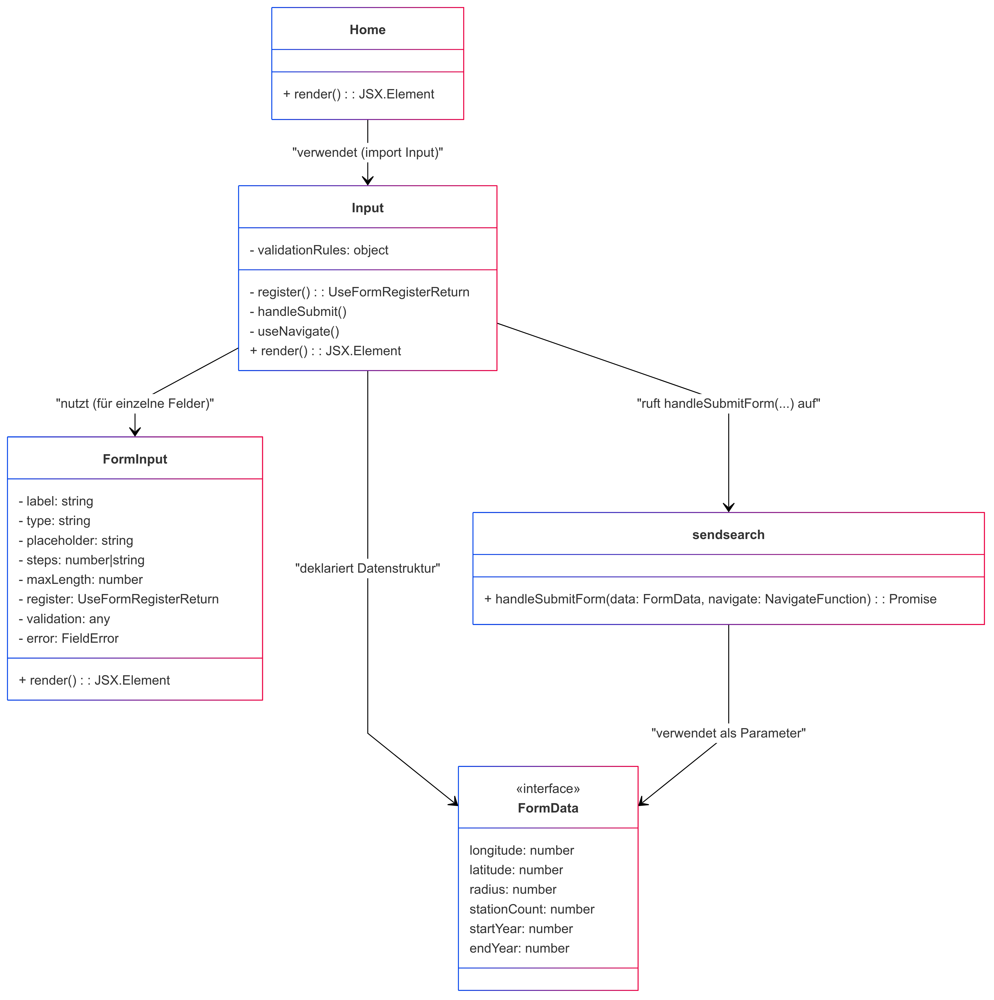

# Erläuterungen zur Seite "Home (Home.tsx)"
Die Seite [Home](../src/pages/Home.tsx) dient als Startseite der Anwendung und verfügt über die Eingabemaske der Suchparameter. Der Aufbau und die grundlegende Funktion der Seite ist wie folgt, darzustellen:

## Verwendete Komponenten
Hervorgehend aus der Aufbauansicht werden auf der Seite folgenden Komponenten verwendet:

- [Input-Form](../src/components/inputs.tsx)

Folgender Service wird im Rahmen der Input-Form verwendet: 
- [Send search](../src/services/sendsearch.tsx)

## Klassendiagramm
> ⚠ **Warnung**  
> In unserem React/TypeScript-Code werden überwiegend Funktionskomponenten und Interfaces verwendet, während das UML-Diagramm diese Elemente als Klassen abbildet. Dadurch erscheinen etwa Methoden wie `render()` oder Zugriffsmodifizierer (`public`/`private`) formal in der UML, obwohl sie im Code als reine Funktionsrückgaben oder State-Variablen existieren.  
> Außerdem sind einige als „Klasse“ dargestellte Strukturen in Wahrheit TypeScript-Interfaces (z. B. `FormData`), was in der UML allerdings konzeptionell abgebildet wurde, um die Beziehungen anschaulich darzustellen.

