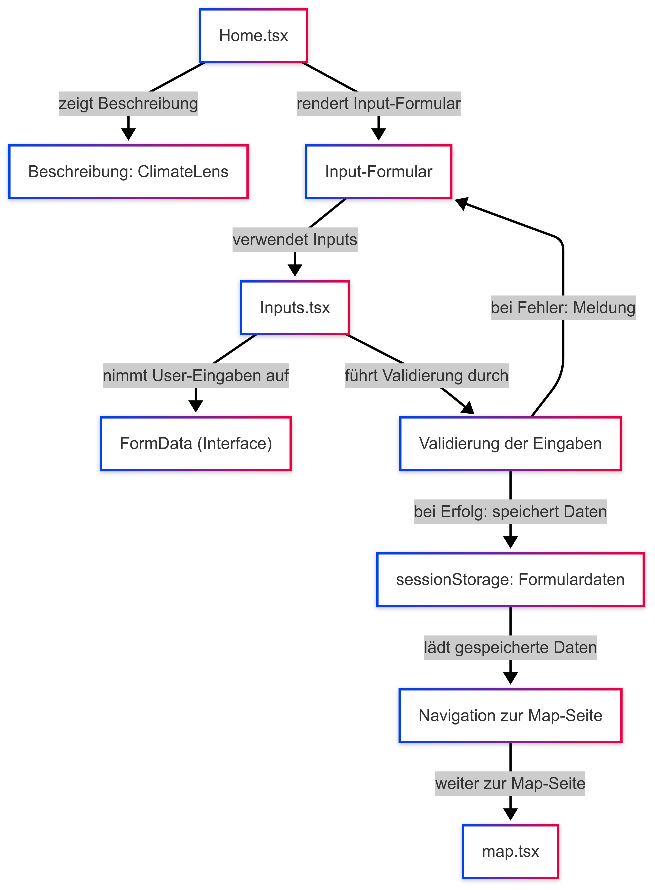
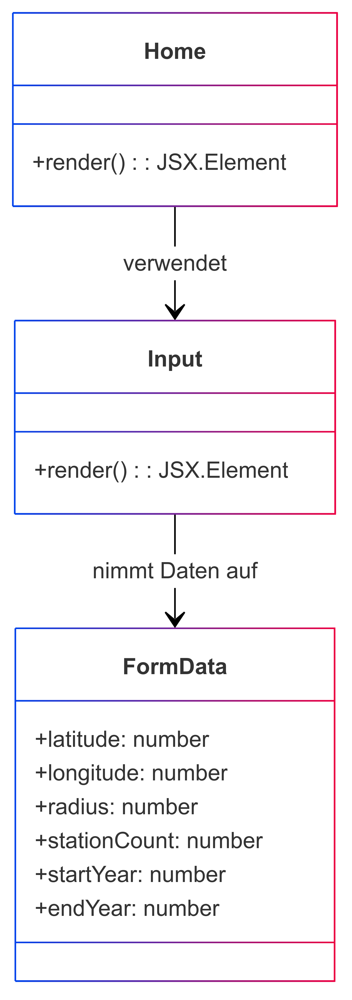

# Erläuterungen zur Seite "Home (Home.tsx)"
Die Seite [Home](../src/pages/Home.tsx) dient als Startseite der Anwendung und verfügt über die Eingabemaske der Suchparameter. Der Aufbau und die grundlegende Funktion der Seite ist wie folgt, darzustellen:

## Verwendete Komponenten
Hervorgehend aus der Aufbauansicht werden auf der Seite folgenden Komponenten verwendet:

- [Input-Form](../src/components/inputs.tsx)

Folgender Service wird im Rahmen der Input-Form verwendet: 
- [Send search](../src/services/sendsearch.tsx)

## Klassendiagramm
⚠ **Hinweis zur UML-Darstellung**  
Dieses UML-Diagramm dient zur konzeptionellen Veranschaulichung der Architektur unserer React/TypeScript-App.  
Da wir überwiegend **Funktionskomponenten und Interfaces** verwenden, werden einige Elemente wie Methoden (`render()`) und Klassen (`class`) in der UML abstrahiert dargestellt.  
Besonders zu beachten:  
- TypeScript-**Interfaces** erscheinen als Klassen, um Relationen darzustellen.  
- Funktionskomponenten sind in der UML als Klassen mit `render()` modelliert, da UML keine direkte Darstellung für React-Hooks bietet.  

