# Erläuterungen zur Seite "Home (Home.tsx)"
Die Seite [Table](../src/pages/table.tsx) dient der Startseite der Anwendung und verfügt über die Eingabemaske der Suchparameter. Der Aufbau und die grundlegende Funktion der Seite ist wie folgt, darzustellen:

## Verwendete Komponenten
Hervorgehend aus der Aufbauansicht werden auf der Seite folgenden Komponenten verwendet:

- [Input-Form](../src/components/inputs.tsx)

## Klassendiagramm
Für die Veranschaulichung der Funktionsweise innerhalb der Seite und ihrer Komponenten wird folgendes Diagramm beigezogen. Dieses Diagramm lehnt sich an ein UML-Klassendiagramm an, enthält aber individuelle Anpassungen, um spezifische Aspekte der Implementierung hervorzuheben:
