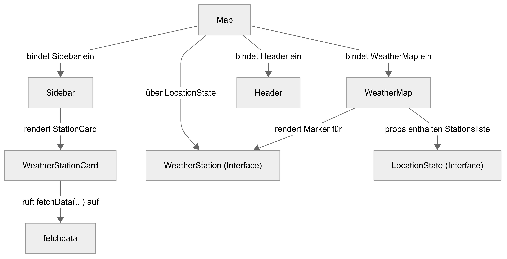
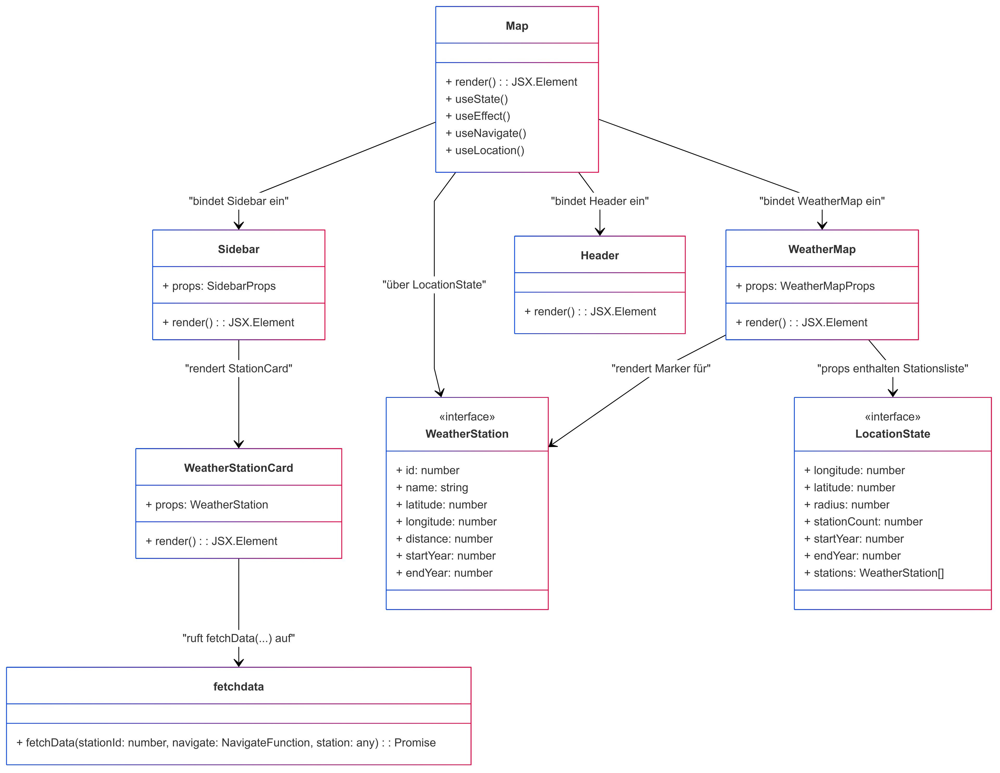

# Erläuterungen zur Seite "Map (Map.tsx)"
Die Seite [Map](../src/pages/map.tsx) wird nach erfolgreichen Suche (Backend verfügbar) angezeigt. Sie dient der Anzeige der verfügbaren Stationen. Der Aufbau und die grundlegende Funktion der Seite ist wie folgt, darzustellen:

## Verwendete Komponenten
Hervorgehend aus der Aufbauansicht werden auf der Seite folgenden Komponenten verwendet:

- [Sidebar-Stations](../src/components/sidebar_stations.tsx)
- [Station Card](../src/components/stationcard.tsx)
- [World Map](../src/components/worldmap.tsx)

Im Rahmen der Abfrage nach Wetterdaten wird folgender Service aufgerufen: 
- [Fetch Data](../src/services/fetchdata.tsx)

## Klassendiagramm

> ⚠ **Warnung**  
> In unserem React/TypeScript-Code werden überwiegend Funktionskomponenten und Interfaces verwendet, während das UML-Diagramm diese Elemente als Klassen abbildet. Dadurch erscheinen etwa Methoden wie `render()` oder Zugriffsmodifizierer (`public`/`private`) formal in der UML, obwohl sie im Code als reine Funktionsrückgaben oder State-Variablen existieren.  
> Außerdem sind einige als „Klasse“ dargestellte Strukturen in Wahrheit TypeScript-Interfaces (z. B. `WeatherStation`), was in der UML allerdings konzeptionell abgebildet wurde, um die Beziehungen anschaulich darzustellen.

