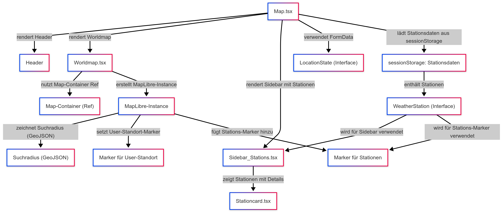

# Erläuterungen zur Seite "Map (Map.tsx)"
**Datei:** [Map.tsx](../src/pages/Map.tsx)

## **Funktionalität und Aufgaben:**
- **Laden der Suchkriterien und Wetterstationen:**
    
    Die Map-Seite erhält ihre Konfiguration entweder über location.state oder aus dem sessionStorage. Dies umfasst:
    - Die Formulardaten, die durch sendsearch.tsx gespeichert wurden.
    - Die Liste der Wetterstationen, die als Antwort des API-Aufrufs in [Sendsearch.tsx](../src/services/Sendsearch.tsx) vom Backend zurückgegeben und gespeichert wurden.

- **Interaktive Kartenanzeige: **
Die Anzeige erfolgt über die Komponente  [Worldmap.tsx.](../src/components/Worldmap.tsx)

    - **Kartenelemente:**
        - *Suchmarker:* Ein roter Marker kennzeichnet den eingegebenen Standort.
        - *Suchradius:* Ein Kreis (erstellt mit Turf.js) stellt den Suchbereich dar. Dieser wird als GeoJSON-Objekt in MapLibre GL eingebunden.
        - Wetterstationen: Alle gefundenen Wetterstationen werden als Marker (blau) dargestellt. Bei Klick auf einen Marker öffnet sich ein Popup mit folgenden Informationen:
            - Stationname
            - Entfernung
             

**- Sidebar:**
Über die Komponente [Sidebar_stations.tsx](../src/components/Sidebar_stations.tsx) wird eine Seitenleiste eingeblendet, in der die einzelnen Wetterstationen aufgelistet werden. 

**- Stationcards:**
- Jede Station wird in einer eigenen StationCard (implementiert in [Stationcard.tsx](../src/components/Stationcard.tsx)) angezeigt.
- Enthalten sind Details wie Name, Koordinaten, Entfernung und ein Button, der den Datenabruf (über [Fetchdata.tsx](../src/services/Fetchdata.tsx)) initiiert. 

**- Navigation:**
Ein „Zurück“-Button ermöglicht es dem Nutzer, wieder zur Home-Seite zurückzukehren.

Folgende Grafik dient der Veranschaulichung der Struktur:

## Technische Details:

- **MapLibre GL:** Wird genutzt, um die Weltkarte zu rendern und interaktive Funktionen wie Navigation und Marker zu ermöglichen.
- **Turf.js:** Erzeugt den GeoJSON-Kreis für den Suchradius.

## Verwendete Komponenten
Hervorgehend aus der Aufbauansicht werden auf der Seite folgenden Komponenten verwendet:

- [Sidebar-Stations](../src/components/sidebar_stations.tsx)
- [Station Card](../src/components/stationcard.tsx)
- [World Map](../src/components/worldmap.tsx)

Im Rahmen der Abfrage nach Wetterdaten wird folgender Service aufgerufen: 
- [Fetch Data](../src/services/fetchdata.tsx)
