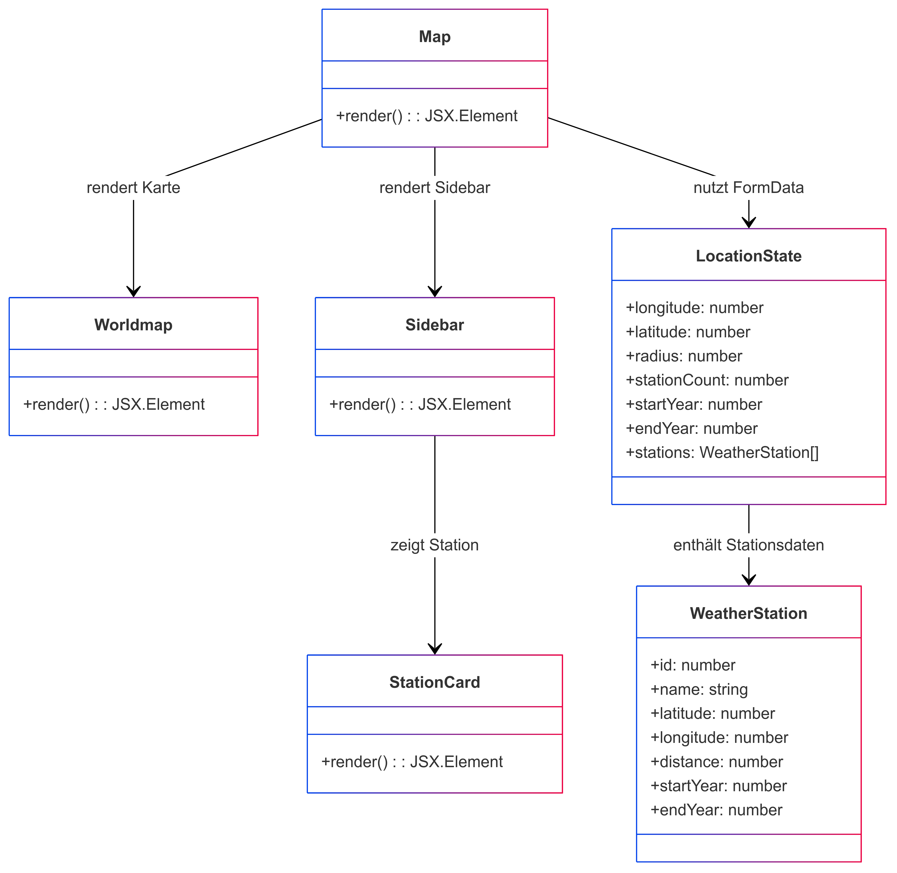

# Erläuterungen zur Seite "Map (Map.tsx)"
Die Seite [Map](../src/pages/map.tsx) wird nach erfolgreichen Suche (Backend verfügbar) angezeigt. Sie dient der Anzeige der verfügbaren Stationen. Der Aufbau und die grundlegende Funktion der Seite ist wie folgt, darzustellen:

## Verwendete Komponenten
Hervorgehend aus der Aufbauansicht werden auf der Seite folgenden Komponenten verwendet:

- [Sidebar-Stations](../src/components/sidebar_stations.tsx)
- [Station Card](../src/components/stationcard.tsx)
- [World Map](../src/components/worldmap.tsx)

Im Rahmen der Abfrage nach Wetterdaten wird folgender Service aufgerufen: 
- [Fetch Data](../src/services/fetchdata.tsx)

## Klassendiagramm
⚠ **Hinweis zur UML-Darstellung**  
Dieses UML-Diagramm dient zur konzeptionellen Veranschaulichung der Architektur unserer React/TypeScript-App.  
Da wir überwiegend **Funktionskomponenten und Interfaces** verwenden, werden einige Elemente wie Methoden (`render()`) und Klassen (`class`) in der UML abstrahiert dargestellt.  
Besonders zu beachten:  
- TypeScript-**Interfaces** (z. B. `WeatherStation`) erscheinen als Klassen, um Relationen darzustellen.  
- Funktionskomponenten sind in der UML als Klassen mit `render()` modelliert, da UML keine direkte Darstellung für React-Hooks bietet.  

