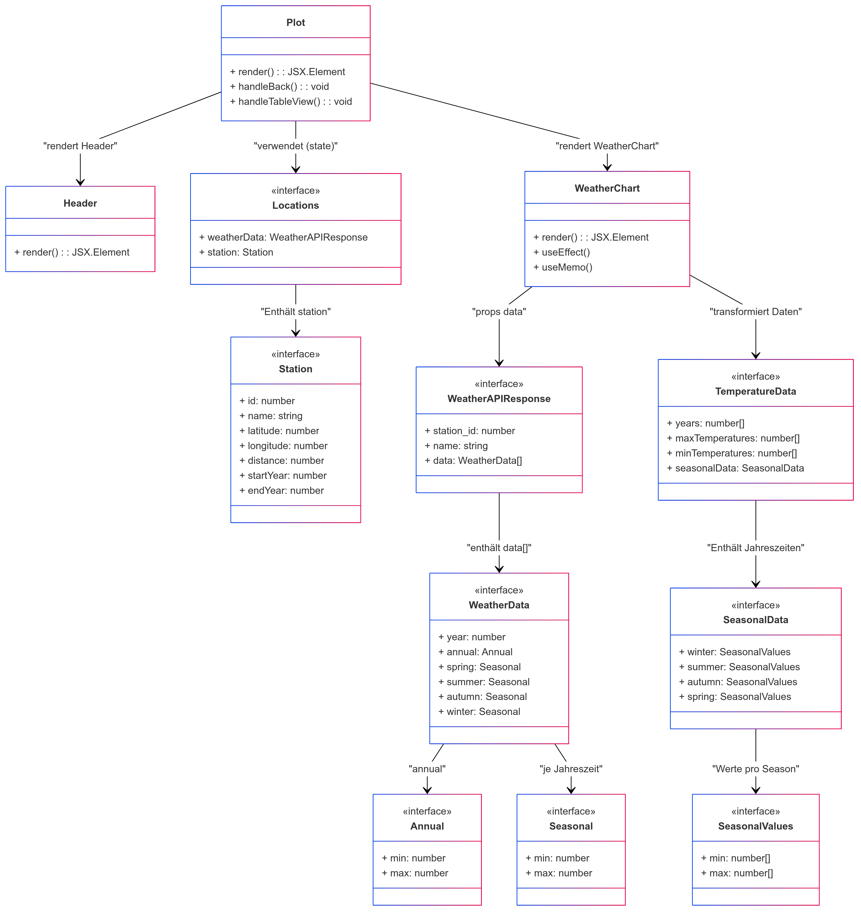

# Erläuterungen zur Seite "Plot (plot.tsx)"
Die Seite [Plot](../src/pages/map.tsx) wird nach Auswahl von Wetterdaten anzeigen von der [Map](../src/pages/map.tsx) angezeigt. Sie dient der Anzeige der vorhandenen Wetterdaten. Der Aufbau und die grundlegende Funktion der Seite ist wie folgt, darzustellen:

## Verwendete Komponenten
Hervorgehend aus der Aufbauansicht werden auf der Seite folgenden Komponenten verwendet:
- [Graph](../src/components/graph.tsx)
- [Header](../src/layouts/header.tsx)

## Klassendiagramm
> ⚠ **Hinweis**  
> In unserem React/TypeScript-Code werden überwiegend Funktionskomponenten und Interfaces verwendet, während das UML-Diagramm diese Elemente als Klassen abbildet. Dadurch erscheinen etwa Methoden wie `render()` oder Zugriffsmodifizierer (`public`/`private`) formal in der UML, obwohl sie im Code als reine Funktionsrückgaben oder State-Variablen existieren.  
> Außerdem sind einige als „Klasse bzw. Schnittstelle“ dargestellte Strukturen in Wahrheit **TypeScript-Interfaces**(z. B. `Station‚`), was in der UML allerdings konzeptionell abgebildet wurde, um die Beziehungen anschaulich darzustellen.

