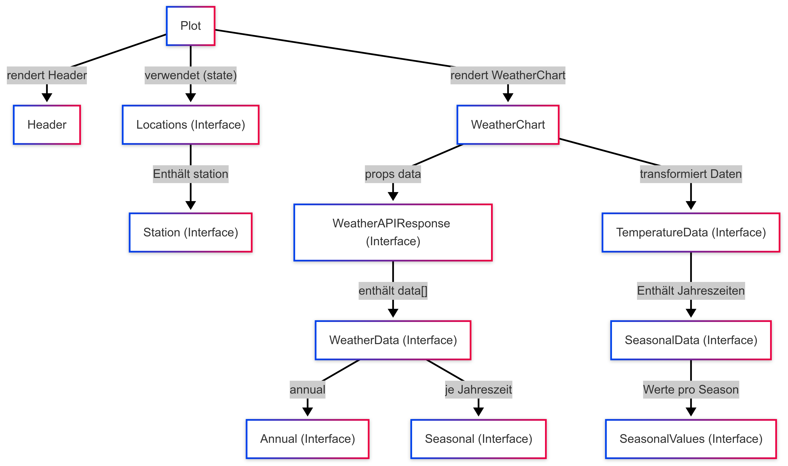

# Erläuterungen zur Seite "Plot (plot.tsx)"
*Datei:* [Plot](../src/pages/Map.tsx) 

## Funktionalitäten und Aufgabe
**Datenabruf und Validierung:**
- Beim Aufruf der Plot-Seite werden Wetter- und Stationsdaten entweder aus location.state oder aus dem sessionStorage geladen.
- Sollte es zu fehlenden Daten kommen, erfolgt eine automatische Weiterleitung zurück zur Map-Seite.

**Grafische Darstellung:**
- Die Wetterdaten werden an die Komponente WeatherChart weitergegeben, die diese mittels Plotly interaktiv visualisiert.

**Diagrammdetails:**
- Standardanzeige: Darstellung der jährlichen Maximal- und Minimaltemperaturen.
- Anzeige der saisonale Daten nach Auswahl: Differenzierung in Frühling, Sommer, Herbst und Winter. Auswahl über Legende des Diagramms.
- Interaktivität: Diagramme unterstützen z.B. Zoom-Funktionen, Ein- und Ausblenden sowie den Download eines PNG-Images.

**Navigation:**
- Ein Button ermöglicht den Wechsel zur tabellarischen Darstellung (Table Page).
  
Im Folgenden werden der graphische Aufbau sowie die grundlegende Funktion der Seite dargestellt.

## Technische Details
**React Hooks:**
- useEffect wird genutzt, um Side Effects wie das Speichern der Daten in sessionStorage zu verwalten.
- useMemo optimiert die Aufbereitung der Daten, indem redundante Berechnungen vermieden werden.
  
**Plotly:** Konfiguriert zur Erstellung dynamischer Linien- und Markerplots, die sowohl jährliche als auch saisonale Trends darstellen.
  
**Datenstruktur:** Typisierte Interfaces (z. B WeatherAPIResponse, WeatherData) garantieren eine saubere Datenstruktur und erleichtern die Weiterverarbeitung im Diagramm.

## Verwendete Komponenten
Hervorgehend aus der Aufbauansicht werden auf der Seite folgende Komponenten verwendet:
- [Graph.tsx](../src/components/Graph.tsx)
- [Header.tsx](../src/layouts/Header.tsx)

