# Erläuterungen zur Seite "Table (table.tsx)"
Die Seite [Table](../src/pages/table.tsx) dient der Ansicht der Wetterdaten im Tabellenformat.  
Der Aufbau und die grundlegende Funktion der Seite ist wie folgt, darzustellen:

## Verwendete Komponenten
Hervorgehend aus der Aufbauansicht werden auf der Seite folgenden Komponenten verwendet:
- [Datatable](../src/components/datatable.tsx)
- [Header](../src/layouts/header.tsx)

## Klassendiagramm
Für die Veranschaulichung der Funktionsweise innerhalb der Seite und ihrer Komponenten wird folgendes Diagramm beigezogen. Dieses Diagramm lehnt sich an ein UML-Klassendiagramm an, enthält aber individuelle Anpassungen, um spezifische Aspekte der Implementierung hervorzuheben:

> ⚠ **Warnung**  
> In unserem React/TypeScript-Code werden überwiegend Funktionskomponenten und Interfaces verwendet, während das UML-Diagramm diese Elemente als Klassen abbildet. Dadurch erscheinen etwa Methoden wie `render()` oder Zugriffsmodifizierer (`public`/`private`) formal in der UML, obwohl sie im Code als reine Funktionsrückgaben oder State-Variablen existieren.  
> Außerdem sind einige als „Klasse“ dargestellte Strukturen in Wahrheit TypeScript-Interfaces (z. B. `TemperatureTableProps`), was in der UML allerdings konzeptionell abgebildet wurde, um die Beziehungen anschaulich darzustellen.

- **Komponentenstruktur:**
Das Diagramm bildet die Hauptkomponenten der Seite ab: die TablePage, die Datatable (alias TemperatureTable) und den Header. Hierdurch soll ersichtlich werden, wie die einzelnen Komponenten organisiert sind und wie sie miteinander interagieren. Die TablePage ist die zentrale Komponente, die unter anderem den Zustand (state) verwaltet und die weiteren Komponenten rendert.

- **Datenfluss:**
Das Diagramm dient dazu aufzuzeigen wie die Daten zwischen den Komponenten fließen. Beispielsweise wird der Zustand (state), der entweder über location.state von der vorherigen Seite übergeben oder als Fallback aus dem sessionStorage geladen wird, in der TablePage gespeichert. Anschließend werden relevante Daten (wie die ausgewählten Spalten) als Prop visibleColumns an die Datatable übergeben. Dieser Pfeil im Diagramm verdeutlicht den Datenfluss zwischen der TablePage und der Datatable.

- **Filterlogik:**
Die Filterlogik, wird durch selectedColumns und visibleColumns dargestellt. Innerhalb der Komponente wird eine interne Spaltenliste mit Hilfe der übergebenen Prop visibleColumns gefiltert. Das Diagramm zeigt dies durch einen entsprechenden Pfeil von der Datatable zur Klasse Column und vermerkt, dass nur die Spalten gerendert werden, deren Schlüssel im Array enthalten sind.

