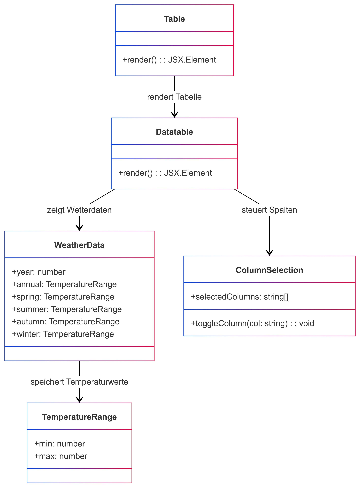

# Erläuterungen zur Seite "Table (table.tsx)"
Die Seite [Table](../src/pages/table.tsx) dient der Ansicht der Wetterdaten im Tabellenformat.  
Der Aufbau und die grundlegende Funktion der Seite ist wie folgt, darzustellen:

## Verwendete Komponenten
Hervorgehend aus der Aufbauansicht werden auf der Seite folgenden Komponenten verwendet:
- [Datatable](../src/components/datatable.tsx)
- [Header](../src/layouts/header.tsx)

## Klassendiagramm
⚠ **Hinweis zur UML-Darstellung**  
Dieses UML-Diagramm dient zur konzeptionellen Veranschaulichung der Architektur unserer React/TypeScript-App.  
Da wir überwiegend **Funktionskomponenten und Interfaces** verwenden, werden einige Elemente wie Methoden (`render()`) und Klassen (`class`) in der UML abstrahiert dargestellt.  
Besonders zu beachten:  
- TypeScript-**Interfaces** (z. B. `TemperatureRange`) erscheinen als Klassen, um Relationen darzustellen.  
- Funktionskomponenten sind in der UML als Klassen mit `render()` modelliert, da UML keine direkte Darstellung für React-Hooks bietet.  

