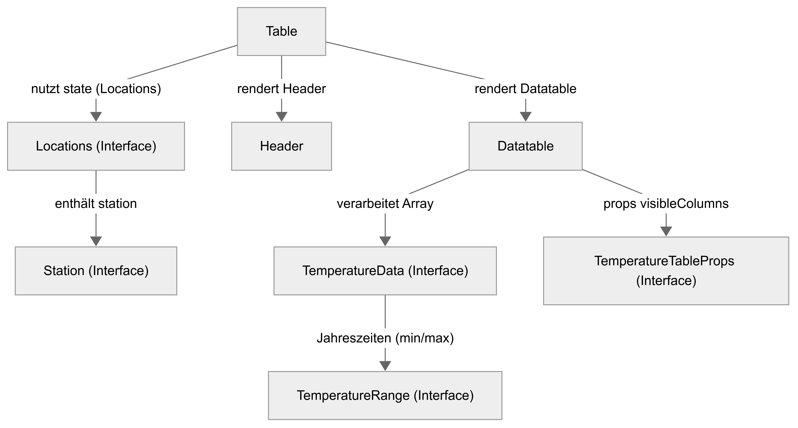
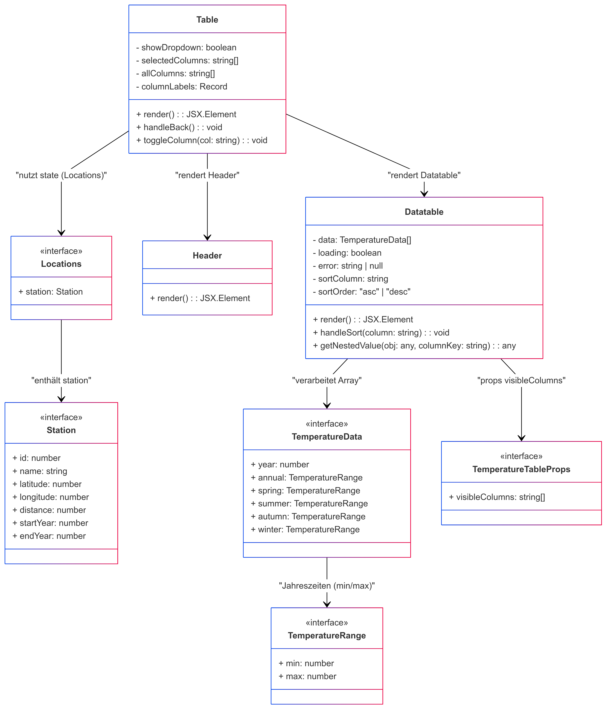

# Erläuterungen zur Seite "Table (table.tsx)"
Die Seite [Table](../src/pages/table.tsx) dient der Ansicht der Wetterdaten im Tabellenformat.  
Der Aufbau und die grundlegende Funktion der Seite ist wie folgt, darzustellen:

## Verwendete Komponenten
Hervorgehend aus der Aufbauansicht werden auf der Seite folgenden Komponenten verwendet:
- [Datatable](../src/components/datatable.tsx)
- [Header](../src/layouts/header.tsx)

## Klassendiagramm
> ⚠ **Hinweis**  
> In unserem React/TypeScript-Code werden überwiegend Funktionskomponenten und Interfaces verwendet, während das UML-Diagramm diese Elemente als Klassen abbildet. Dadurch erscheinen etwa Methoden wie `render()` oder Zugriffsmodifizierer (`public`/`private`) formal in der UML, obwohl sie im Code als reine Funktionsrückgaben oder State-Variablen existieren.  
> Außerdem sind einige als „Klasse bzw. Schnittstelle“ dargestellte Strukturen in Wahrheit **TypeScript-Interfaces**(z. B. `TemperatureTableProps`), was in der UML allerdings konzeptionell abgebildet wurde, um die Beziehungen anschaulich darzustellen.

**Beziehungen im Diagramm:** 
Die Table-Komponente rendert sowohl den Header als auch die Datatable und nutzt dabei den Zustand, der durch Locations bereitgestellt wird. Locations beinhaltet eine Station, was die Verbindung zwischen Standortinformationen und der Station zeigt. Die Datatable verarbeitet ein Array von TemperatureData, wobei die saisonalen Temperaturbereiche durch TemperatureRange spezifiziert werden. Zusätzlich bezieht die Datatable die Sichtbarkeitsinformationen der Spalten aus den TemperatureTableProps.
 

