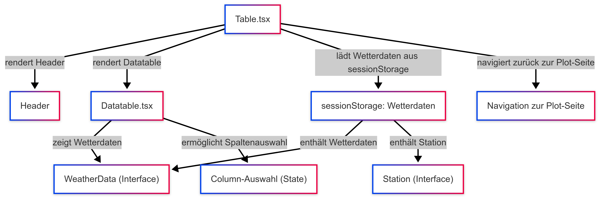

# Erläuterungen zur Seite "Table (table.tsx)"
*Datei:* [Table](../src/pages/table.tsx)   

## Funktionalitäten und Aufgabe
**Datenquelle:**
- Wie in der Plot-Seite werden die Wetterdaten aus der sessionStorage geladen.

**Tabellarische Darstellung:**
- Die Wetterdaten werden in einer dynamischen Tabelle angezeigt, die folgende Features bietet:
    - Sortierbarkeit: Jede Spalte, z. B. Jahr, jährliche Max/Min oder saisonale Werte, kann sortiert werden.
    - Spaltenauswahl: Der Nutzer kann über ein Dropdown-Menü bestimmen, welche Spalten angezeigt werden sollen. Die Komponente verwaltet eine Liste der „selectedColumn“, die dynamisch angepasst werden kann.

**Navigation:** Ein „Zurück“-Button führt zur Plot-Seite zurück, sodass der Nutzer zwischen der grafischen und tabellarischen Ansicht wechseln kann.

Der Aufbau und die grundlegende Funktion der Seite ist wie folgt, darzustellen:

## Technische Details
- **React State:** Lokale States verwalten Ladezustände, Sortierkriterien und die Sichtbarkeit einzelner Spalten.

## Verwendete Komponenten
Hervorgehend aus der Aufbauansicht werden auf der Seite folgenden Komponenten verwendet:
- [Datatable](../src/components/datatable.tsx)
- [Header](../src/layouts/header.tsx)

